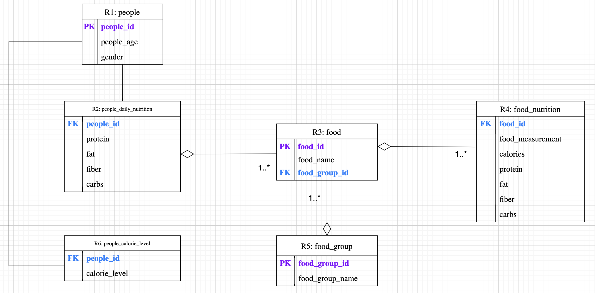

# Relational-Database-Team-Project
## INTRODUCTION
The objective of the project is to create a prototype of a relational database management system (RDBMS) associated with food, nutrition, and people. By utilizing this RDBMS, we can answer some questions such as how to create a healthy diet, choose a reasonable amount of food, and figure out the essential nutrition for certain age groups of people. We believe that promoting living a healthy life is significant. The domains of the data in this project include food, food category, nutrition of the food, people, and essential nutrition of people. 
## METHODS
The method to construct this project follows a regular pathway to build up an RDBMS, including formulating functional dependencies of the domains, constructing the schema, creating a UML diagram for the relationship, fixing violations of the normalization, creating the DBMS, and utilizing the DBMS to answer our questions.
### UML DIAGRAMS
According to the UML diagrams (Figure 1), R1:People and R2: people_daily_nutrition is one-to-one relationship; R1: people and R6: people_daily_calorie is one-to-one relationship; R2: people_daily_nutrition and R3: food is one-to-many relationship; R3: food and R4: food_nutrition is one-to-many relationship; R3: food and R5: food_group is a many-to-one relationship.

## CODE IMPLEMENTATION
First, run [INITIALIZATION](Code/INITIALIZATION.sql) to build up the database with the data tables.
Second, run [Queries_All_in_One](Code/Queries_All_in_One.sql) to test four type of queries: Aggregation, Subquery, Insert, and Update
